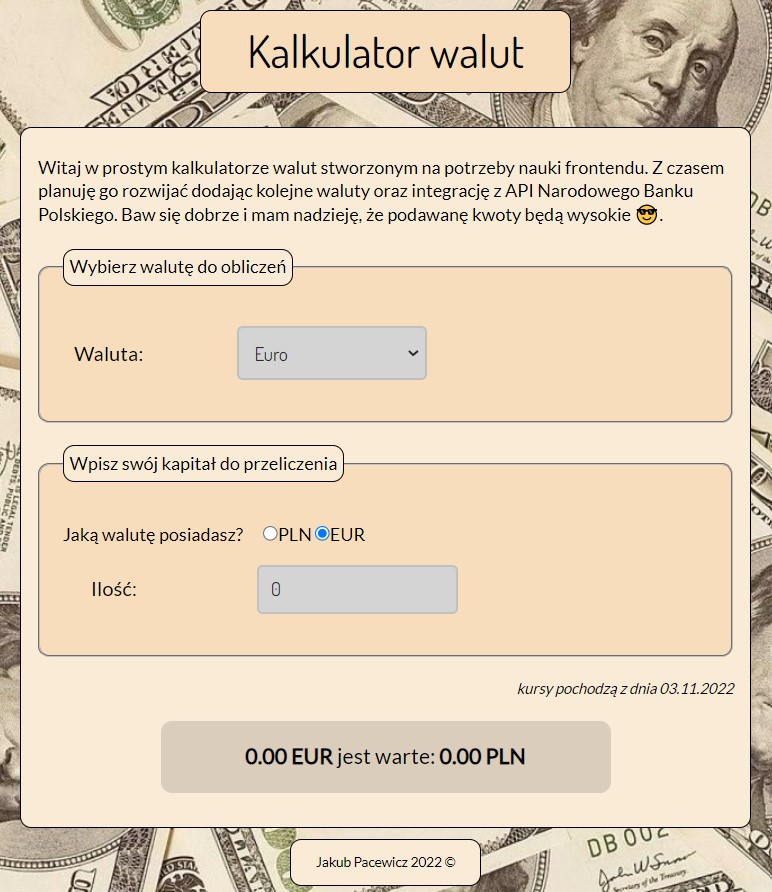

# currency-converter-PLN-
A simple currency converter targets to polish users.
It can convert *PLN* into *EUR/USD/GBP* or *EUR/USD/GBP* into *PLN*.
## Demo
https://pecet3.github.io/currency-converter-PLN-/
## why I made it?
Because I'm learning frontend and it was one of the homeworks.
I'd like to add API of Polish National Bank in the future, but I cannot to do it yet :)
## Screenshot

